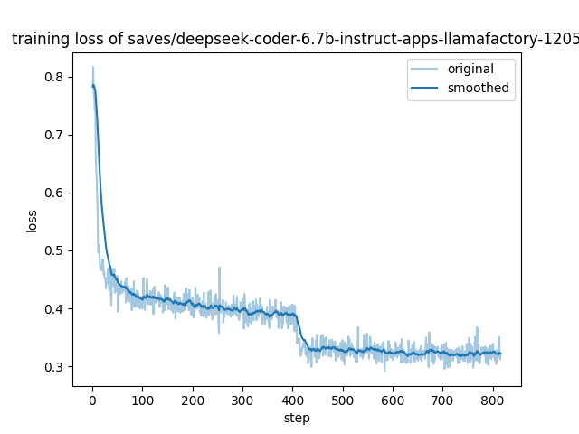

## Experiments on APPS dataset

To test the performance of SFT training of LlamaFactory, we run experiments on the APPS dataset. We conduct SFT training on the APPS training dataset, and test the model on APPS test dataset. Below we list configurations of our experiment.

**Dataset source**: https://huggingface.co/datasets/codeparrot/apps/tree/main

**Model**: deepseek-coder-6.7b-instruct

**Requirements**: 
We use Python 3.10.13.
1. Copy source code from `/lustre/S/huangdi/open_for_out/models/LLaMA-Factory.tar`
2. Run `pip install -r asserts/LlamaFactory/requirements.txt`
3. Download `flash_attn` and install: https://github.com/Dao-AILab/flash-attention/releases/download/v2.5.0/flash_attn-2.5.0+cu122torch2.1cxx11abiFALSE-cp310-cp310-linux_x86_64.whl
4. Install LlamaFactory:


```bash
cd LLaMA-Factory
pip install -e ".[torch,metrics]"
```

### Training procedure

I run the experiments on 8 `A100-PCIE-40GB` GPUs (`r8a100-a02`).
The detailed training config is in `asserts/LlamaFactory/dscoderinst_full_sft_ds3.yaml`, please copy it to `examples/train_full` in LlamaFactory repo.

The bash command for training:

```bash
llamafactory-cli train examples/train_full/dscoderinst_full_sft_ds3.yaml
```

The total training time for the two epochs are `8h58min33s`.

#### Training loss



Last step loss: 0.3207

### Evaluation

Currently, a total of 3,765 problems from the test set are evaluated, with problems lacking solutions filtered out. For each problem, 10 pieces of code are generated. The `sampling temperature` is set to `0.6`, and `top_p` is set to `0.95`. 

The inference stage is run on 8 GPUs (`r8a100-a02`) with the following command:

```bash
python -m llmkit_data.cli.sample --prompts $DATAFILE_PATH --out $SAMPLE_PATH --model $MODEL_PATH --gpu_per_model 1
python -m llmkit_data.cli.eval_apps --samples $SAMPLE_PATH --out $RESULT_PATH --apps $APPS_PATH
```
Inference is conducted using `vllm`, taking `16min35s` for code generation, and approximately 20 minutes for evaluation. 

#### Results:

The pass@1, pass@5, and pass@10 statistics across different difficulty levels are presented in the table below:

| Difficulty   | pass@1               | pass@5              | pass@10             |
| ------------ | -------------------- | ------------------- | ------------------- |
| total        | 0.131792828685259    | 0.2378675773098084  | 0.2836653386454183  |
| introductory | 0.3541208791208791   | 0.5332068724925868  | 0.5947802197802198  |
| interview    | 0.08584525119178585  | 0.18114562779029225 | 0.2258892555922259  |
| competition  | 0.013870967741935483 | 0.04326676907322069 | 0.06129032258064516 |


For comparison, there is an experiment for the original `deepseek-coder-6.7b-instruct` model. 

| Difficulty   | pass@1               | pass@5               | pass@10             |
| ------------ | -------------------- | -------------------- | ------------------- |
| total        | 0.11723771580345287  | 0.20706064630367418  | 0.24833997343957503 |
| introductory | 0.3244505494505494   | 0.46723465027036454  | 0.5260989010989011  |
| interview    | 0.07418408507517418  | 0.1581393589094359   | 0.19801980198019803 |
| competition  | 0.009354838709677418 | 0.026420890937019968 | 0.03870967741935484 |