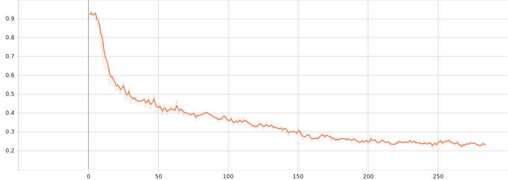
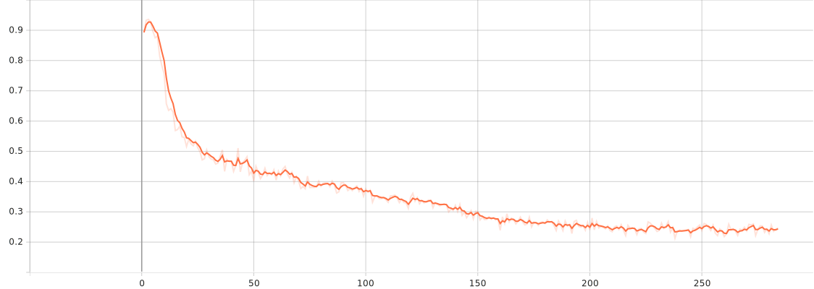

## What is TRL?

Quote from TRL's readme:

> TRL is a cutting-edge library designed for post-training foundation models using advanced techniques like Supervised Fine-Tuning (SFT), 
> Proximal Policy Optimization (PPO), and Direct Preference Optimization (DPO). 
> Built on top of the 🤗 Transformers ecosystem, TRL supports a variety of model architectures and modalities, and can be scaled-up across various hardware setups.

In short, TRL is a library developed by the Hugging Face team. TRL offers a foundational layer for fine-tuning, while frameworks like [LlamaFactory](./LlamaFactory.md) offers additional features and a potentially better user interface.

## Environment setup

```bash
# create environment
conda create -n trl python=3.11
conda activate trl

# Install PyTorch with CUDA support:
module load cuda-cudnn/12.1-8.9.3
pip install torch --index-url https://download.pytorch.org/whl/cu121

pip install trl

# Install llmkit-data for data processing and evaluation
git clone http://62.234.201.16/llm-kit/Data.git
pip install -e Data

# Install flash-attention2 (Optional)
# curl -O https://github.com/Dao-AILab/flash-attention/releases/download/v2.7.2.post1/flash_attn-2.7.2.post1+cu12torch2.5cxx11abiFALSE-cp311-cp311-linux_x86_64.whl
# pip install ./flash_attn-2.7.2.post1+cu12torch2.5cxx11abiFALSE-cp311-cp311-linux_x86_64.whl --no-build-isolation

# Install deepspeed (Optional, required only for speeding up multi-GPU training)
pip install deepspeed

# Install vllm for inference
pip install vllm

pip install tensorboardX
```

Then download [APPS](https://huggingface.co/datasets/codeparrot/apps) and Create a directory named result to store your training results.

```bash
APPS=/path/to/apps
result=/path/to/result
```


## Data processing

This step prepares the dataset in a standard format using the llmkit_data library.

```bash
## Process Train set
python -m llmkit_data.cli.prep_apps \
    --apps ${APPS}/train.jsonl \
    --out ${result}/dataset/train.jsonl \
    --type SFT

## Process Test set
python -m llmkit_data.cli.prep_apps \
    --apps ${APPS}/test.jsonl \
    --out ${result}/dataset/test.jsonl \
    --type SFT \
    --prompt_only
```

:::{caution}
This conversion process is designed for single-turn instruction datasets. By default, TRL masks the user prompt and trains on the response.

For multi-turn conversations, the standard conversion provided here is not sufficient. You will need to investigate how TRL handles multi-turn data and implement a custom converter accordingly. This might involve structuring the data into conversation turns or using different training strategies within TRL.
:::

```bash
python -m llmkit_data.cli.convert_to_trl \
    --dataset ${result}/dataset/train.jsonl \
    --out ${result}/trl_dataset/train.jsonl
```

This is only can be used for oneturn instruction dataset.
By default, TRL should mask the user prompt and training on reponse.
For multiturn converstation, you need to find out how TRL deal with them and write you own converter.


## Training

This section details the training process using TRL.

TRL provides numerous examples on their [webpage](https://huggingface.co/docs/trl/example_overview) and in their [repository](https://github.com/huggingface/trl/tree/main/examples).

Our configuration is based on [deepspeed_zero3](https://github.com/huggingface/trl/blob/main/examples/accelerate_configs/deepspeed_zero3.yaml). To minimize configuration changes, we will use TRL's example configuration and modify its contents via command-line arguments.  Therefore, some fields in the configuration file may not reflect the actual settings used during training.

The script launched by `accelerate` is a copy of [sft.py](https://github.com/huggingface/trl/blob/main/trl/scripts/sft.py) with a minor modification.

```python
    tokenizer = AutoTokenizer.from_pretrained(
        model_args.model_name_or_path, trust_remote_code=model_args.trust_remote_code, use_fast=True, padding_side="right"
    )
```
The key change is adding `padding_side="right"` to avoid a warning. However, due to packing, its impact may be limited.

Before running the training commands, download the configuration file and training script, place them in `$result`, and then set the necessary environment variables to execute the commands directly."

```bash
base_model=/lustre/S/huangdi/open_for_out/models/deepseek-coder-6.7b-instruct
config=${result}/deepspeed_zero3.yaml
script=${result}/sft.py
```

For a single node with 8 GPUs, you should run:

```bash
LAUNCHER="\
accelerate launch \
  --config_file ${config} \
  --num_processes 8 \
"

PROGRAM="\
  ${script} \
  --model_name_or_path ${base_model} \
  --dataset_name ${result}/trl_dataset \
  --bf16 \
  --seed 42 \
  --packing \
  --max_seq_length 2048 \
  --num_train_epochs 2 \
  --per_device_train_batch_size 2 \
  --gradient_accumulation_steps 16 \
  --gradient_checkpointing \
  --learning_rate 2.0e-5 \
  --lr_scheduler_type cosine \
  --warmup_steps 25 \
  --torch_dtype bfloat16 \
  --save_strategy no \
  --output_dir ${result}/model \
  --report_to tensorboard \
  --logging_steps=1 \
"

bash -c "$LAUNCHER $PROGRAM"
```

To use flash attention for acceleration, you should add the following parameter:
```bash
  --attn_implementation flash_attention_2 \
```

However, in the versions I tested (transformers==4.47.1, flash_attn==2.7.2.post1), they appear to be incompatible, resulting in the following error:
```plaintext
TypeError: _flash_attention_forward() got an unexpected keyword argument 'num_items_in_batch'
```

To launch a multi-node task, you should refer to the [accelerate documentation](https://huggingface.co/docs/accelerate/basic_tutorials/launch). There is also a [Slurm example](https://github.com/huggingface/accelerate/blob/main/examples/slurm/submit_multinode.sh)
and a multi-node training example  can be found in [Finetuning Llama2 70B](https://huggingface.co/blog/ram-efficient-pytorch-fsdp)


```bash
LAUNCHER="\
accelerate launch \
  --config_file ${config} \
  --num_processes $((SLURM_NNODES * USER_GPUS_PER_NODE)) \
  --num_machines $SLURM_NNODES \
  --main_process_ip $MASTER_ADDR \
  --main_process_port $MASTER_PORT \
  --machine_rank \$SLURM_PROCID\
"

PROGRAM="\
  ${script} \
  --model_name_or_path ${base_model} \
  --dataset_name ${result}/trl_dataset \
  --bf16 \
  --seed 42 \
  --packing \
  --max_seq_length 2048 \
  --num_train_epochs 2 \
  --per_device_train_batch_size 2 \
  --gradient_accumulation_steps 16 \
  --gradient_checkpointing \
  --learning_rate 2.0e-5 \
  --lr_scheduler_type cosine \
  --warmup_steps 25 \
  --torch_dtype bfloat16 \
  --save_strategy no \
  --output_dir ${result}/model \
  --report_to tensorboard \
  --logging_steps=1 \
"

bash -c "$LAUNCHER $PROGRAM"
```

:::{tip}
You may be wondering why we need to input commands as strings and then use `bash -c ${cmd}`.
The reason is to ensure that `--machine_rank \$SLURM_PROCID\` is correctly translated. Without this, the training process may become stuck.
:::

When submitting a task to multi-node Slurm, you may want certain tasks, such as data processing and evaluation, to be performed only once. Here is one way to achieve this:
```bash
flag=${result}/finished.flag
if [[ $SLURM_PROCID -eq 0 ]]; then
    # Main process logic
    echo "Main process, preprocessing dataset."
    python -m llmkit_data.cli.prep_apps \
        --apps ${APPS}/train.jsonl \
        --out ${result}/dataset/train.jsonl \
        --type SFT

    python -m llmkit_data.cli.prep_apps \
        --apps ${APPS}/test.jsonl \
        --out ${result}/dataset/test.jsonl \
        --type SFT \
        --prompt_only

    python -m llmkit_data.cli.convert_to_trl \
        --dataset ${result}/dataset/train.jsonl \
        --out ${result}/trl_dataset/train.jsonl

    # Signal other processes to continue
    touch ${flag}
else
    # Other processes wait for the main process to finish
    while [[ ! -f ${flag} ]]; do
        sleep 1
    done
fi
```

The TensorBoard logs can be found in the `${result}/model/runs`.

## Evaluation

llmkit-data offers tools for performing inference and evaluation. Here's how to use them:
```bash
python -m llmkit_data.cli.sample \
    --prompts ${result}/dataset/test.jsonl \
    --out ${samples} \
    --model ${result}/model \
    --gpu_per_model 1

python -m llmkit_data.cli.eval_apps \
    --samples ${samples} \
    --out ${evals} \
    --apps ${APPS}
```

Similar to single-node evaluation, we can perform multi-node evaluation using the Slurm environment variable `SLURM_PROCID`:
```bash
if [[ $SLURM_PROCID -eq 0 ]]; then
    # Main process logic
    echo "Main process, evaluating result."

    python -m llmkit_data.cli.sample \
        --prompts ${result}/dataset/test.jsonl \
        --out ${samples} \
        --model ${result}/model \
        --gpu_per_model 1

    python -m llmkit_data.cli.eval_apps \
        --samples ${samples} \
        --out ${evals} \
        --apps ${APPS}

    rm ${flag}
fi
```
This script ensures only the main process (`SLURM_PROCID -eq 0`) performs inference and evaluation, avoiding redundant computation on other nodes.

:::{tip}
**Process Bar Bug:**
If you encounter a non-functional process bar, it might be related to the reported bug in [](https://github.com/vllm-project/vllm/issues/10949). As of now, there's no documented solution.
:::


## Results

**Performance Comparison: 1-Node vs. 2-Node (A100-40G)**

| Metric                        | 1 Node (8 GPUs) | 2 Nodes (4 GPUs/node)  |
| ----------------------------  | --------------- | ---------------------- |
| Train Runtime (seconds)       | 19750.8989      | 13263.2354             |
| Train Samples/Second          | 3.688           | 5.492                  |
| Train Steps/Second            | 0.014           | 0.021                  |
| Train Loss                    | 0.3478          | 0.3483                 |


As the table clearly shows, the 2-node configuration significantly outperforms the 1-node configuration in terms of runtime and throughput (samples/second and steps/second), despite using the same total number of GPUs. The difference in loss is negligible.

:::{tip}
Packing is a critical factor for performance.
Without packing, the training runtime is 53,587.42 seconds, with 3.903 samples processed per second, 0.015 steps completed per second, and a training loss of 0.2179.
***However, a lower loss does not indicate a better result; in fact, the final result is even worse than the base model.***
This configuration only modifies the packing strategy compared to the 1 node × 8 GPU setup.
:::

**1 Node * 8 A100-40G**

| Difficulty   | pass@1                | pass@5                | pass@10              |
| ------------ | --------------------- | --------------------- | -------------------- |
| total        | 0.1154316069057105    | 0.2112660469234174    | 0.2557768924302789   |
| interview    | 0.06989365603226988   | 0.15193159527592973   | 0.19508617528419508  |
| competition  | 0.006774193548387097  | 0.027956989247311825  | 0.04516129032258064  |
| introductory | 0.33228021978021977   | 0.5115831589045875    | 0.5728021978021978   |

**2 Nodes * 4 A100-40G**

| Difficulty   | pass@1                | pass@5                | pass@10              |
| ------------ | --------------------- | --------------------- | -------------------- |
| total        | 0.11282868525896414   | 0.20518771474946773   | 0.25152722443559095  |
| interview    | 0.06725339200586725   | 0.1475602586713698    | 0.19288595526219288  |
| competition  | 0.0070967741935483875 | 0.0228494623655914    | 0.03225806451612903  |
| introductory | 0.32857142857142857   | 0.49869723530437815   | 0.5645604395604396   |

**base**

| Difficulty   | pass@1               | pass@5               | pass@10             |
| ------------ | -------------------- | -------------------- | ------------------- |
| total        | 0.11723771580345287  | 0.20706064630367418  | 0.24833997343957503 |
| introductory | 0.3244505494505494   | 0.46723465027036454  | 0.5260989010989011  |
| interview    | 0.07418408507517418  | 0.1581393589094359   | 0.19801980198019803 |
| competition  | 0.009354838709677418 | 0.026420890937019968 | 0.03870967741935484 |

**1 Node * 8 A100-40G Loss** 



**2 Nodes * 4 A100-40G Loss**




While the provided script offers a starting point for training large language models using TRL, further investigation is needed to optimize model performance.
The evaluation benchmarks haven't shown a significant improvement after training.

**Download**

Here are the resources included in this guide:
- [requirements](./assets/TRL/requirements.txt)
- [sft](./assets/TRL/sft.py)
- [deepspeed config](./assets/TRL/deepspeed_zero3.yaml)
- [single node](./assets/TRL/singlenode_run.sh)
- [multi node](./assets/TRL/multinode_run.sh)

For SLURM scripts, you should copy the following templates: `/tools/template.gpu.slurm` for single-node jobs, 
`/tools/template.multi-gpus.slurm` & `/tools/template.multi-gpus-task.sh` for multi-node jobs.
Follow the instructions within the slurm scripts to configure them, and execute your script at the job step.